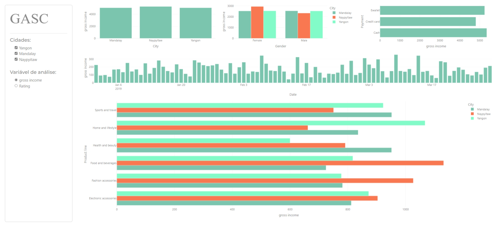

# Estudo de Python com Plotly e Dash

Bem-vindo ao meu repositório de estudo! Aqui, estou explorando o mundo da programação em Python, com um foco especial nas bibliotecas Plotly e Dash, para criar dashboards interativos.

## Objetivo

Meu principal objetivo é aprender a criar visualizações de dados interativas e painéis de controle atraentes usando Python. As bibliotecas Plotly e Dash são ferramentas poderosas que me permitem atingir esse objetivo.

## Ambiente Virtual

Estou utilizando um ambiente virtual para garantir a isolamento e a organização do meu projeto. Isso ajuda a gerenciar as dependências específicas do projeto e manter tudo organizado.

## Progresso

Ao longo do tempo, planejo construir vários dashboards interativos e compartilhar meu progresso neste repositório. Isso incluirá exemplos, tutoriais e projetos que demonstrem o que aprendi e como estou aplicando esse conhecimento.

Fique à vontade para acompanhar meu progresso e contribuir com sugestões ou comentários. Estou empolgado para aprender e crescer neste caminho emocionante da visualização de dados e criação de dashboards interativos em Python!

## Alguns Dashs

### Estudo Prático Dashboards

\_\_Conteúdo fornecido pela plataforma Asimov Academy

### Dash - Gráfico Simples

3. Primeiro projeto - Dashboard de vendas3.
   

## Contato

Se você quiser entrar em contato comigo ou tiver alguma sugestão, fique à vontade para me enviar uma mensagem. Você pode me encontrar [aqui](gilmar.alexandre.sc@outlook.com

Obrigado por acompanhar minha jornada de aprendizado!
